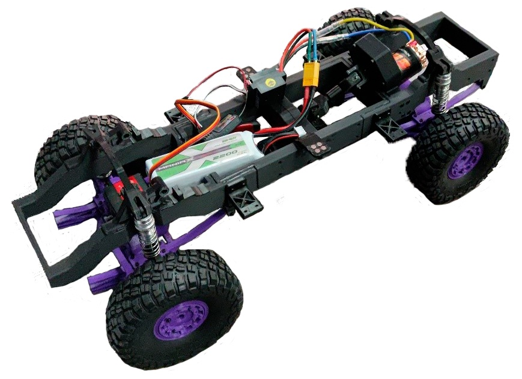
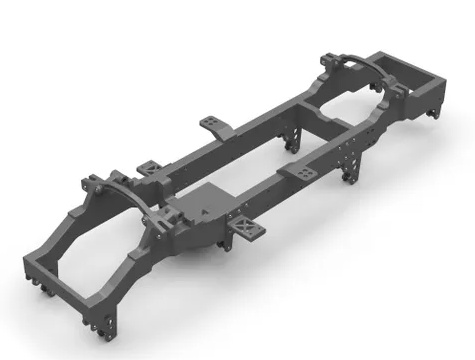
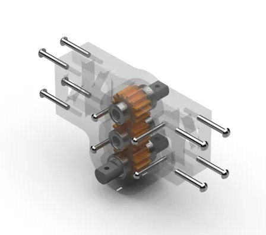
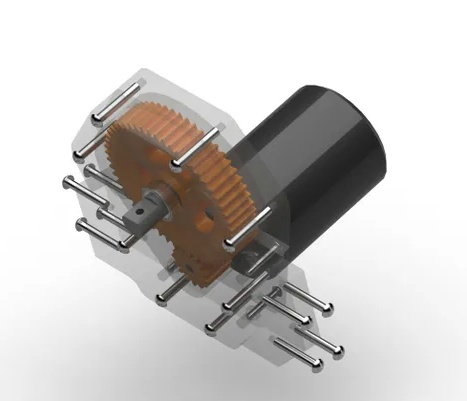
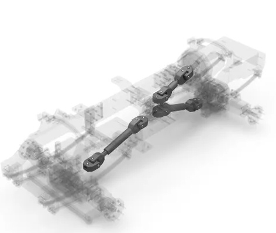
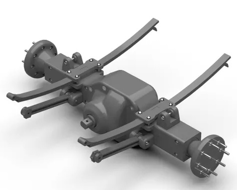
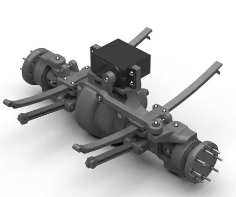

# VAC

Данный проект является инновационным школьный проектом, который объединяет 3D-моделирование, 3D-печать, электронику и виртуальную реальность для создания и соревнования миниатюрных внедорожников. Проект направлен на развитие технических и командных навыков учащихся, а также на популяризацию STEM-образования.
На проект актуален т.к. направлен на достижение множества целей.
Развитие технических навыков:
o	Обучение учащихся основам 3D-моделирования и 3D-печати.
o	Приобретение навыков работы с электроникой и программированием.
o	Изучение принципов работы и конструкции автомобилей.
Развитие командной работы:
o	Формирование команд, состоящих из пилотов, штурманов и механиков.
o	Развитие навыков коммуникации и взаимодействия в команде.
Популяризация STEM-образования:
o	Привлечение внимания учащихся к науке, технологии, инженерии и математике.
o	Создание интересной и увлекательной платформы для обучения.
Проведение соревнований:
o	Организация и проведение соревнований между командами.
o	Разработка трасс и заданий, требующих стратегического мышления и технических навыков.
Внедрение технологий аддитивного производства и 3д-печати в промышленности растет по мере того, как появляются новые идеи, в которых используются их преимущества и функциональные возможности. В то время как продолжаются технические успехи с точки зрения их продуктивности в процессе производительности и качества этих технологий, есть опасения, что образование и развитие навыков отстают от этих технических разработок и что они могут препятствовать более широкому внедрению технологий. Несмотря на эти опасения и давний призыв к совершенствованию образовательной деятельности, в настоящее время отсутствует всеобъемлющий и доступный набор литературы и инструментов для того, чтобы технологии 3д-печати эффективно использовались в системе образования. 
Чтобы восполнить этот недостаток, в данной работе предлагается создание внедорожника для проведения некоторых соревнований, который позволит охватить широкий спектр технологий:
1.	3д моделирование. По инструкциям, чертежам и видеоматериалам обучающийся научиться создавать 3д модели в предложенных CAD системах.
2.	3д печать. Созданные модели обучающийся сможет подготовить в слайсере под печать и напечатать на 3д-принтере. Все модели были созданы с расчётом на 3д-печать.
3.	Конструирование. Все напечатанные детали возможно собрать по инструкции в различные действующие изделия.
4.	Электротехника. Готовое изделие подразумевает использование элементов электроники и микроконтроллера ARDUINO, что позволит изучить и попрактиковать навыки паяния и сборки схем.

В настоящее время технологии недостаточно развиты, как и среди взрослых людей, так и среди молодежи. Данный проект может заинтересовать многих людей в изучении технологий в виде проведения соревнований по прохождению трасс по бездорожью. В команде состоят 2 человека: инженер и водитель. Инженер собирает аппарат для прохождения трасс, а в случае поломки чинит его во время заезда, а водитель управляет данным аппаратом. Данный вариант изучение технологий выполняет многие функции что может заинтересовать людей:
1.	Обучающая. Каждый участник разбирается в том, как устроен его аппарат.
2.	Социальная. Во время проведения подобный мероприятий можно найти друзей и единомышленников который тоже заинтересованы в изучении технологий.
3.	Развлекательная. Участие в таких мероприятиях будет интересно для всех как в качестве обучения, так и развлечения

Чтобы восполнить недостатки образовательных технологий в сфере обучения 3д печати и аддитивного производства, можно задать два вопроса:
1.	Где в системе образования используется 3д-печать? 
2.	Как 3д-печать используется в системе образования?
Чтобы ответить на эти вопросы, мы изучали различную образовательную литературу, в которой используется применение аддитивных технологий (АТ) и технологий для 3д-печати(3ДП) в обучении и образовании. В системе образования наблюдается, что большая часть оборудования АТ и 3ДП печати, используемого в учебных целях, представляет собой недорогое оборудование 3ДП потребительского класса, а не более сложные оборудование АТ, которое используется для изготовления усовершенствованных прототипов и конечных продуктов.
Использование технологий цифрового производства, таких как 3ДП, для поддержки образования далеко не ново. Дисциплины архитектуры и инженерии первыми внедрили технологии быстрого прототипирования во внеурочной деятельности, и было выявлено множество преимуществ, связанных с внедрением этих технологий в обучение. 

При выборе варианта стоял выбор, какой конструкции, формы и функционала должен был быть наш проект. 
Вид проекта остановился на полноприводном внедорожнике с электрическим двигателем, сервоприводом, аккумулятором, переключателем скоростей, радиоприемником и пультом управления. Предположительная длинна внедорожника была 50см.
Также ниже приведена таблица сравнения разных видов пластика, из которого мог состоять наш проект:

В итоге был достигнут желаемый результат. Проект находится в полном рабочем состоянии. Проект имеет красивый внешний вид. Если внедорожник сломается, то заменить детали на запасные не составит сложности. Также проект имеет достаточно простую и легкую в понимании конструкцию, что обеспечивает простое освоение технологии его создания.
Проект будет развивается и следующим шагом к развитию проекта будет создания корпуса.

Себестоимость проекта составила за 24 220 рублей и тогда вместе с наценкой она будет стоить 30 000 рублей + НДС 24%. Следовательно стоимость проекта составит 37200
На рынке не было найдено прототипов или готовых изделий схожих на нашу разработку по этому точной цены сказать невозможно, но она будет определенно выше той за которую мы продаем наш проект. Наш проект будет пользоваться спросом у узконаправленной аудитории, поэтому такая цена является довольно приемлемой.

